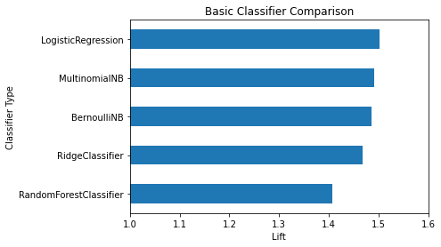
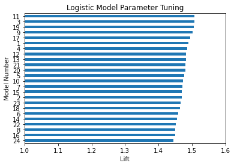
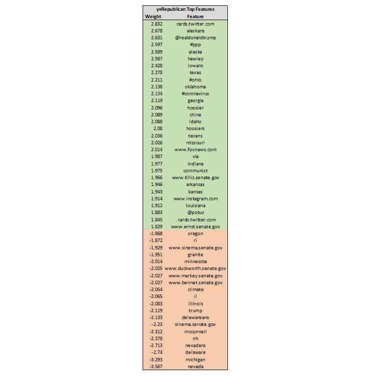

\spacing{1.5}

# Abstract 

This paper looks at classifying tweets made by U.S. Senators as belonging to a particular political party based on the text characteristics of the tweets. After using Python to scrape data from senatorial Twitter accounts, natural language processing techniques are implemented to clean and extract important features. A wide variety of statistical classification models are then fit from this data, with the best one achieving an out-of-sample prediction accuracy of 85% and a corresponding lift of 1.5. I find this out-of-sample prediction performance to be satisfactory, though after extracting important features from the best model, the performance appears to be more based on the naturally occurring differences in tweets due to factors such as geography as opposed to political polarization. 

\newpage

# Introduction 

In many ways our modern political climate seems to be more polarized than ever before. Especially in the United States, politicians from both sides of the aisle tend to diligently stick to the party line in terms of voting behavior and public speech. The goal of this paper is to test the degree to which statistical models can pick up on this phenomenon by exploring the Twitter behavior and content of public officials. Specifically, I want to know whether statistical models can be trained to identify whether a given tweet was made by a Democrat or Republican based solely on the text content of the tweet. Once the model is trained, I also want to explore the particular characteristics of tweets that identify them as belonging to either a Democrat or Republican. This stated objectives of this project are important to pursue because they can aid in understanding the nature of the political discourse in our country. Independent thinking, reasonable discourse, and willingness to compromise have produced many of the great societal achievements in American history. If a statistical model can consistently predict party affiliation based on the textual content of a given document, it may be a sign that some of those elements are lacking in our current political climate. 

# Methods 

The bulk of the work for this project concerned the scraping and cleaning of Twitter data. All of the scraping, cleaning, and analysis was performed using Python. To build the dataset, I identified the Twitter accounts associated with each U.S. senator, then proceeded to scrape all tweets from those accounts from January 1, 2020 until May 1, 2020. This dataset, comprised of 43,611 tweets, was then scrubbed and processed to make it useful for fitting statistical models. After a few basic transformations of variables, the next step in processing the data was tokenization. Tokenization involves breaking the text down into its individual components, often applying rules such as splitting on punctuation marks or whitespace. While there are many possible methods for tokenizing text, I primarily relied on two common natural language processing modules available in Python, SpaCy and NLTK. Using these modules I tested a variety of tokenizers that each applied different rules to generate the tokens. An ancillary part of the tokenization process is lemmatization, which reduces tokens down to their root word. This was also incorporated in several of the tokenizers that were tested on the data. In addition to using tokenizers that only generated tokens for single words, I also applied tokenizers that generated tokens for combinations of words. This allowed the models trained to pick up on basic interactions between adjacent words in a tweet.

After tokenization, the new dataset, consisting of counts of tokens associated with each tweet, was now in a form that could be used to fit statistical models. In addition to just using the raw counts of tokens, I also tested models using term frequency–inverse document frequency (TFIDF) weights in order to scale the counts according to their relative importance in the overall corpus of terms. Both of these sets of data, the raw count data and the TFIDF data, were then fed into a variety of classification models to estimate fits and form predictors. For the purposes of this paper, models were trained to either classify tweets as coming from a Republican or from a Democrat/Independent. This seemed like a reasonable simplification, as only two current U.S. senators are Independents, and their views and voting patterns tend to generally align with those of Democrats. Averaging over several different train-test splits of data, I was then able to identify the single model that had the best performance in terms of out-of-sample prediction. 

After discovering the best model type and parameters for out-of-sample prediction, I then used that model in order to identify the particular tokens that had the most importance in determining whether a particular tweet belonged to a Democrat/Independent or a Republican. The best model was re-fit on the entire dataset, then the coefficients corresponding to individual tokens were extracted to identify the most important features for prediction. 

\newpage

# Results 

Figure 1 shows the out-of-sample predictive performance of several different types of classification methods as measured by lift, the ratio of prediction accuracy of the given model and the prediction accuracy of the null model. The null model simply predicts that the class of every tweet will be the class with the highest frequency in the training data. While several of the classifier models performed similarly, the classifier with the best performance was the one based on logistic regression, which had an average lift of 1.50 which corresponded to an out-of-sample prediction accuracy of 85.1%. While not shown explicitly in a figure, logistic regression was consistently the best modeling method across a wide range of tokenization methods and parameter specifications.

 

Figure 2 shows the out-of-sample predictive performance of many logistic regression models, each having a different specification of parameters or using a different tokenizer. It was unfeasible to list every parameter for each regression in this figure, but the best model (11) is a model that uses an NLTK tokenizer, considers both individual words and adjacent words to create tokens, and is based on count data (as opposed to TFIDF). Even though it was averaged over different train-test splits compared to those in Figure 1, it had very similar performance with an average lift of 1.51 and an out-of-sample prediction accuracy of 85.1%. 

 

Figure 3 shows the 50 most important features in the best logistic regression model after it was trained on the entire dataset for predicting Democrat/Independent vs Republican. The numbers are given in terms of predicting y=Republican as the outcome, so positive coefficients correspond to features that are highly associated with Republican tweets, while negative coefficients correspond to features that are highly associated with Democratic tweets. While the weights are not numbers that can be interpreted as causal effects, they do show the relative importance of the features. 

\newpage

 

\newpage

# Conclusion 

As mentioned previously, the best model was selected by looking at out-of-sample prediction accuracy and lift. Other metrics such as precision and recall were also calculated and considered, but those were relatively similar across estimation methods and models that performed the best in terms of out-of-sample prediction tended have a good balance across all three measures. The best model implemented logistic regression and had a lift of approximately 1.5 and an out-of-sample prediction accuracy of approximately 85%. I found it personally surprising that the random forest classifier consistently lagged behind the other classification methods in terms of performance. This is likely due to the large dimension of the data, which ranged from approximately 40,000 x 40,000 to 40,000 x 400,000 depending on the tokenization process that was used. Even when singular value decomposition was used to reduce the dataset to 100 components (comprising approximately 27% of the variance), the performance of the random performance classifier was still not improved. Another key takeaway was the importance of considering two word phrases in the tokenization process. Models that used tokenizers that allowed for tokens to consist of two words instead of just one consistently outperformed models that used only singular tokens.

The extraction of important features from the best model yields several interesting insights. While some of the top features could be interpreted as being indicative of political polarization (the use of "@realdonaldtrump" and "@potus" by Republicans as opposed to simply "trump" by Democrats/Independents, the use of "communist" by Republicans, the use of "climate" by Democrats/Independents, and the use of "www.foxnews.com" by Republicans), most of the key features don't fit in with the "political polarization" theory I initially proposed. Geographic keywords, which don't really indicate political polarization in my view, are clearly essential to making the party classification. This makes sense, as political parties are largely segregated geographically and senators of a certain party will be more likely to have tweets associated with those geographic areas. Links to websites associated with particular senators are also important for making the classifications.

Overall, I think achieving a model with a lift of ~1.5 is a satisfying result for this project, but I think there is still a lot of room for improving upon this performance, specifically in the area of natural language processing. This is where I spent most of my time on this project, but I still know that I have a lot to learn.  

